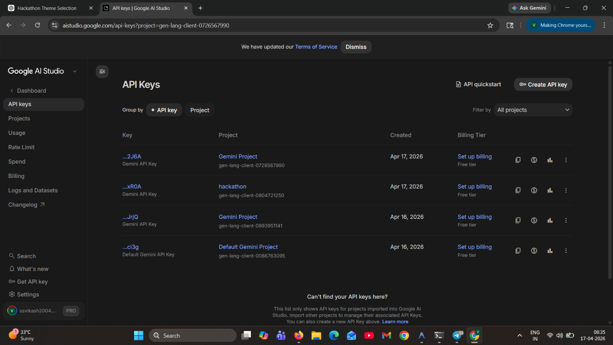
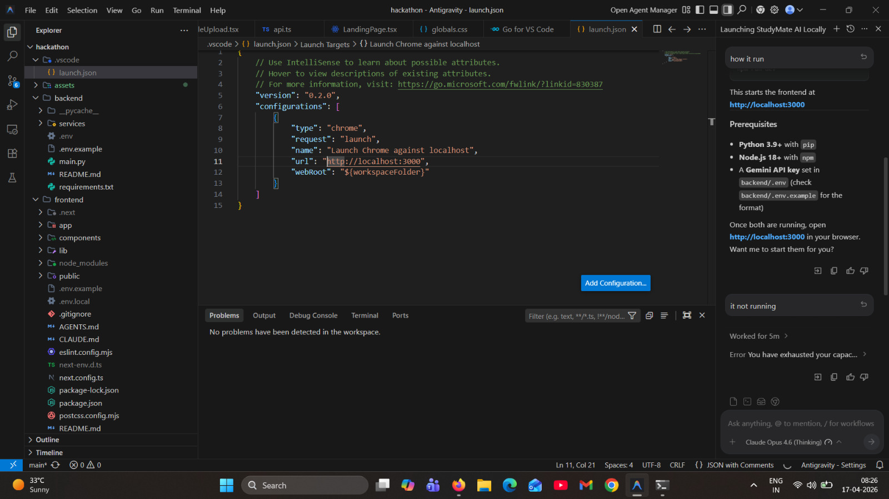
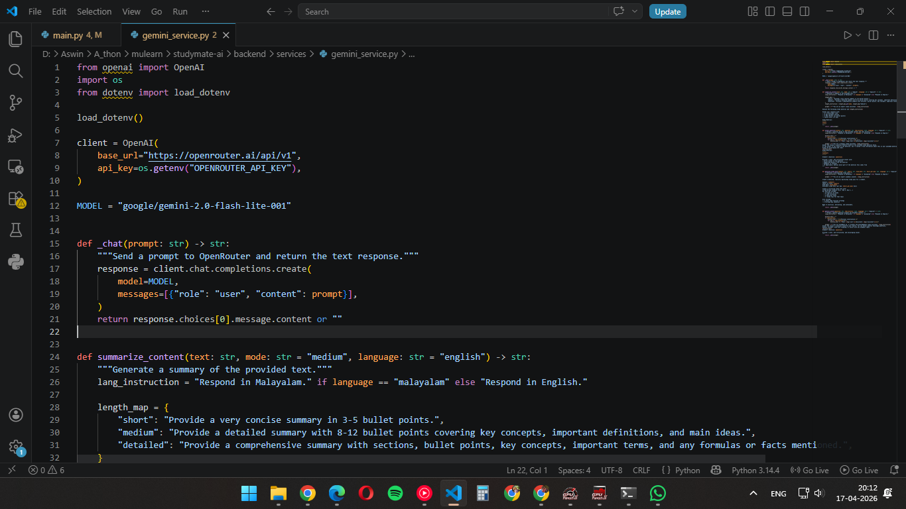
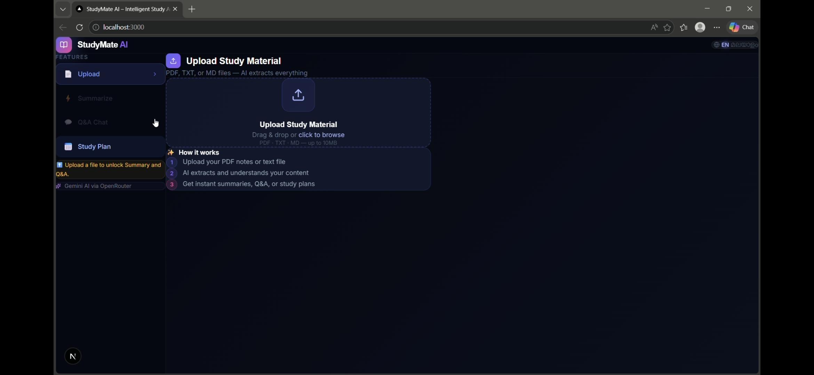
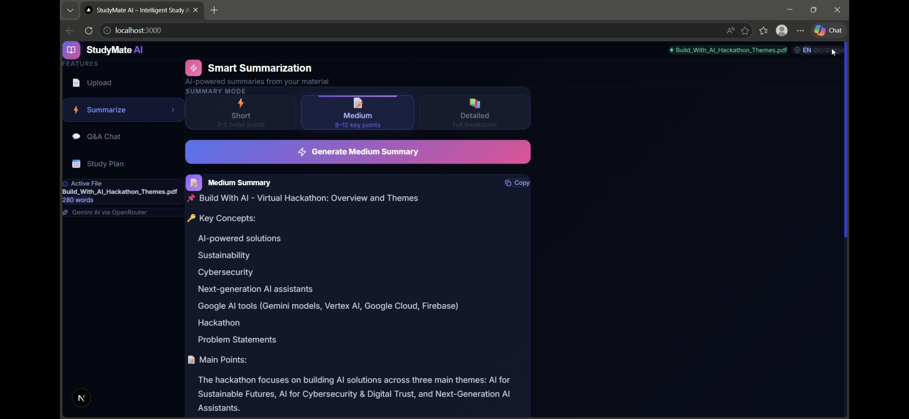
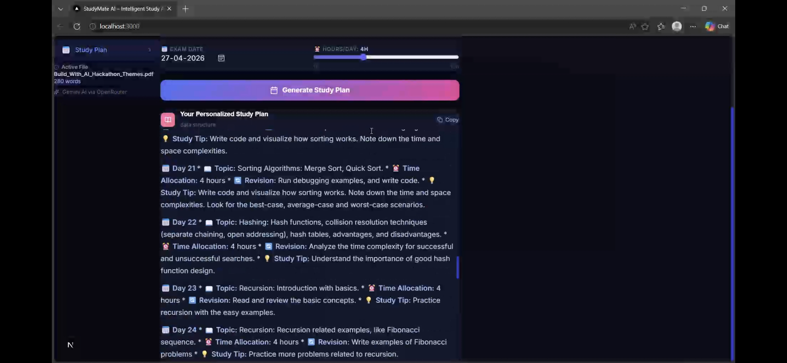
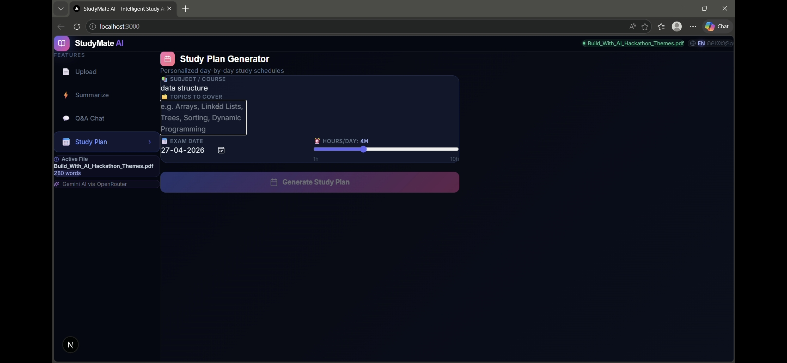
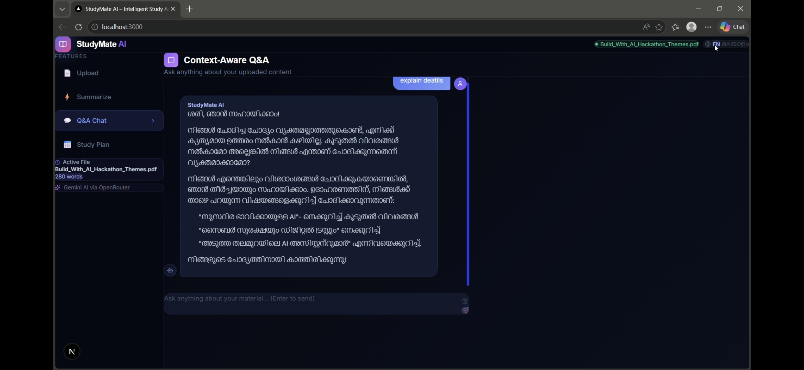

<div align="center">

# 📚 StudyMate AI

### *Your AI-Powered Study Assistant — Study Smarter, Not Harder*

[](https://nextjs.org/)
[](https://fastapi.tiangolo.com/)
[](https://ai.google.dev/)
[](LICENSE)

</div>

---

## 🧩 Problem Statement

Students today struggle with **information overload** — lengthy textbooks, scattered notes, and no personalized guidance on *what* to study or *how* to study it. Traditional methods of manually summarizing material, searching for answers, and creating study schedules are **time-consuming and inefficient**, especially before exams.

There is a clear need for an intelligent tool that can:
- Instantly summarize large volumes of study material
- Answer specific questions based on uploaded content
- Generate personalized, day-by-day study plans
- Support students in their native language

---

## 💡 Project Description

**StudyMate AI** is a full-stack, AI-powered study assistant that helps students learn faster and more effectively. Users can upload their study materials (PDFs, text files, or markdown notes), and the app uses **Google Gemini AI** to provide:

| Feature | Description |
|---|---|
| 📄 **Document Upload** | Upload PDFs, TXT, or MD files — AI extracts and processes content instantly |
| ⚡ **Smart Summarization** | Get bullet-point summaries in Short, Medium, or Detailed mode |
| 💬 **Context-Aware Q&A** | Ask questions about your material — AI answers strictly from your uploaded content |
| 📅 **Study Plan Generator** | Input your exam date, subject, and topics — get a personalized day-by-day schedule |
| 🌐 **Bilingual Support** | Full English and Malayalam language support for all features |
| 🤖 **General AI Chat** | Chat with AI even without uploading a document for general academic help |

### What Makes It Useful

- **Zero signup** — start studying immediately
- **Privacy-first** — documents are processed in-memory, never stored permanently
- **Smart chunking** — handles large documents by intelligently splitting and overlapping text
- **Chat history** — maintains conversation context for follow-up questions
- **Beautiful UI** — premium dark-mode interface with glassmorphism, animations, and responsive design

---

## 🤖 Google AI Usage

### Tools / Models Used

- **Google Gemini 2.0 Flash Lite** (`google/gemini-2.0-flash-lite-001`) — via OpenRouter API
- **Google AI Python SDK** (`google-generativeai`) — listed as a project dependency
- **Google AI Studio** — For API access and configuration
- **Antigravity** — Text editor with an integrated AI agent used for development
  

### How Google AI Was Used

Google Gemini AI is the **core intelligence** powering every feature of StudyMate AI:

1. **Document Summarization** — Gemini receives extracted document text along with structured prompts to generate formatted summaries with key concepts, main points, and quick facts. Supports three detail levels (short/medium/detailed).

2. **Context-Aware Q&A** — When a student asks a question, Gemini receives the document context (up to 12,000 characters via smart chunking) along with chat history (last 3 Q&A pairs) to provide accurate, context-grounded answers.

3. **Study Plan Generation** — Gemini acts as an expert academic planner, creating day-by-day study schedules with time allocation, revision tasks, and study tips based on the student's subject, topics, exam date, and available hours.

4. **General AI Chat** — Gemini functions as a friendly study assistant for general academic questions, even without any uploaded document.

All AI calls go through a centralized `_chat()` function in the backend, ensuring consistent model usage and easy configurability.

---

## 🖼️ Proof of Google AI Usage

### API Key


### Gemini in Antigravity


### Gemini Model Integration Code


---

## 📸 Screenshots

### 📄 App Workspace — File Upload



### 📅 Study Plan Generator




### 🏠 Q&A Page


---

## 🎬 Demo Video

[▶️ Watch Demo](https://youtu.be/REu21IwGw4o)

---

## 🏗️ Tech Stack

| Layer | Technology |
|---|---|
| **Frontend** | Next.js 16, React 19, TypeScript, Tailwind CSS 4 |
| **Backend** | Python, FastAPI, Uvicorn |
| **AI Model** | Google Gemini 2.0 Flash Lite (via OpenRouter) |
| **PDF Processing** | PyPDF |
| **UI Components** | Lucide React Icons, React Dropzone, React Markdown |
| **Styling** | Glassmorphism, Dark Mode, CSS Animations |

---

## 🚀 Installation Steps

### Prerequisites

- **Node.js** (v18 or higher)
- **Python** (v3.10 or higher)
- **OpenRouter API Key** — get one free at [openrouter.ai](https://openrouter.ai/)

### 1. Clone the Repository

```bash
git clone https://github.com/ssvikash2004-hub/studymate-ai.git
cd studymate-ai
```

### 2. Setup Backend

```bash
# Go to backend folder
cd backend

# Create a virtual environment (optional but recommended)
python -m venv venv
venv\Scripts\activate        # Windows
# source venv/bin/activate   # macOS/Linux

# Install Python dependencies
pip install -r requirements.txt

# Create environment file
copy .env.example .env
# Edit .env and add your OpenRouter API key:
# OPENROUTER_API_KEY=your_openrouter_api_key_here

# Run the backend server
python main.py
```

The backend will start at **http://localhost:8000**

### 3. Setup Frontend

```bash
# Open a new terminal and go to frontend folder
cd frontend

# Install Node dependencies
npm install

# Create environment file
copy .env.example .env.local
# The default API URL (http://localhost:8000) should work out of the box

# Run the frontend dev server
npm run dev
```

The frontend will start at **http://localhost:3000**

### 4. Start Using StudyMate AI

1. Open **http://localhost:3000** in your browser
2. Click **"Start Studying Now"**
3. Upload a PDF or text file
4. Explore Summarization, Q&A Chat, and Study Plan features!

---

## 📁 Project Structure

```
studymate-ai/
├── backend/
│   ├── main.py                  # FastAPI server with all API routes
│   ├── services/
│   │   ├── gemini_service.py    # Google Gemini AI integration
│   │   └── pdf_service.py       # PDF/text extraction & chunking
│   ├── requirements.txt         # Python dependencies
│   └── .env.example             # Environment template
├── frontend/
│   ├── app/
│   │   ├── page.tsx             # Main entry page
│   │   ├── layout.tsx           # Root layout with fonts
│   │   └── globals.css          # Global styles & design system
│   ├── components/
│   │   ├── LandingPage.tsx      # Hero landing page
│   │   ├── AppWorkspace.tsx     # Main app workspace with tabs
│   │   ├── FileUpload.tsx       # Drag & drop file upload
│   │   ├── SummaryPanel.tsx     # AI summarization panel
│   │   ├── ChatInterface.tsx    # Q&A chat interface
│   │   └── StudyPlanPanel.tsx   # Study plan generator
│   ├── lib/
│   │   └── api.ts               # API client for backend calls
│   └── package.json             # Node dependencies
├── proof/                       # Google AI usage screenshots & Project screenshots
└── README.md
```

---

## 🔌 API Endpoints

| Method | Endpoint | Description |
|---|---|---|
| `GET` | `/` | Health check |
| `POST` | `/upload` | Upload PDF/TXT/MD file |
| `POST` | `/summarize` | Generate AI summary |
| `POST` | `/ask` | Context-aware Q&A |
| `POST` | `/study-plan` | Generate study plan |
| `POST` | `/general-chat` | General AI chat |
| `DELETE` | `/document/{id}` | Remove uploaded document |

---

## 👥 Team

> Add your team members here.

| Name | Role |
|---|---|
| Vikash SS | Backend |
| EV Aswin | Frontend |

---

<div align="center">

**Built with ❤️ for Hackathon | Powered by Google Gemini AI**

</div>
